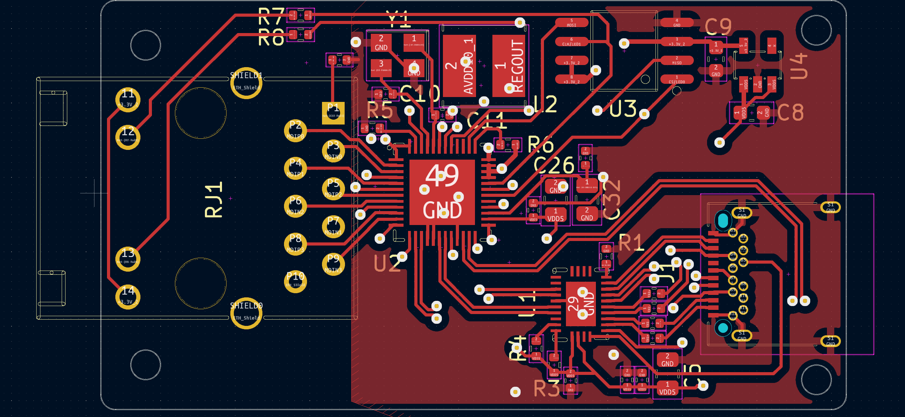
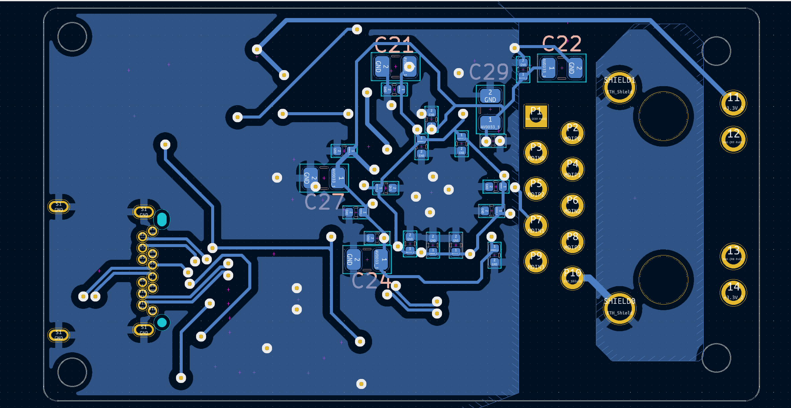
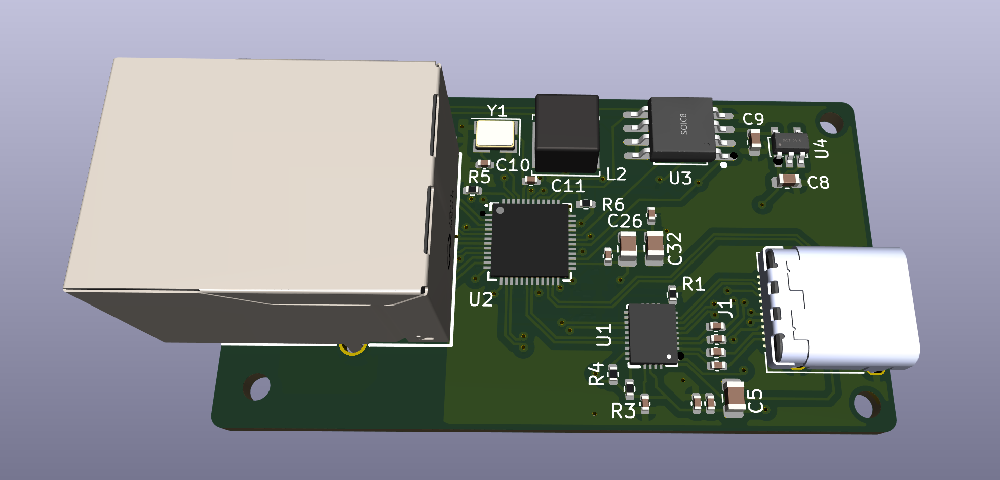
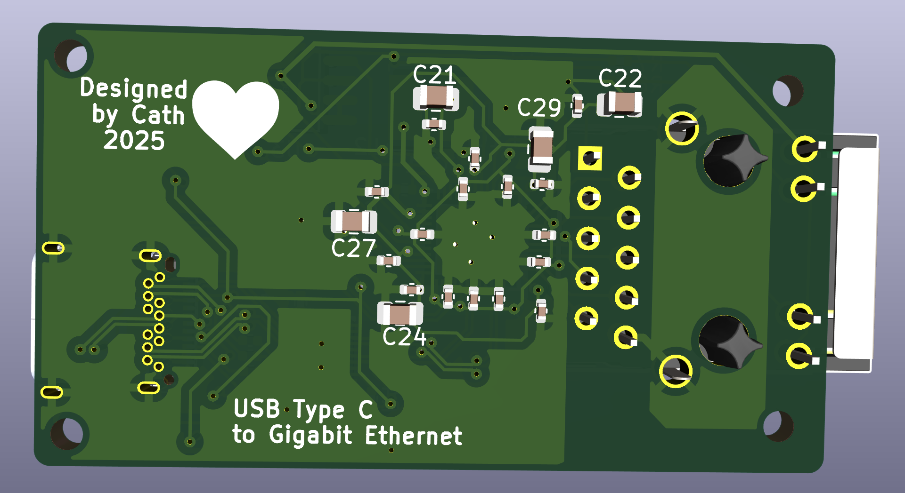

# USB 3.2 gen 1 to Gigabit Ethernet
 Gigabit Ethenet to USB C using VL162 and RTL8153

 ## VL162

  - 4:2 10Gbps USB Type-C Data Switch

  - Low power consumption with 6mW active at device mode

 ## RTL8153 

  - Integrated 10/100/1000M transceiver

  - Supports USB 3.0, 2.0, and 1.1

 ###  Built-in Voltage Regulators

- 5.0V to 3.3V LDO

- 3.3V to 1.2V Switching regulator

 ## TLV70233DBVR

 - 5V to 3.3V LDO for spi flash and leds

 ## W25Q16BVSSIG

 - 16Mbit SPI Flash  

 ## HR911130A
 - RJ45 Port with integrated magnetics 
 - 1000 Base-T Magnetics 

  

## PCB 
This board uses a 4 layer stackup with a  1.6mm thickness:

- POWER/SIGNAL

- GND
  
- GND
  
- POWER/SIGNAL

High Speed diferential lines need a refrence ground plane so internal planes are ground referance planes for the High speed USB lines

### Schematic:

## PCB Screenshots

